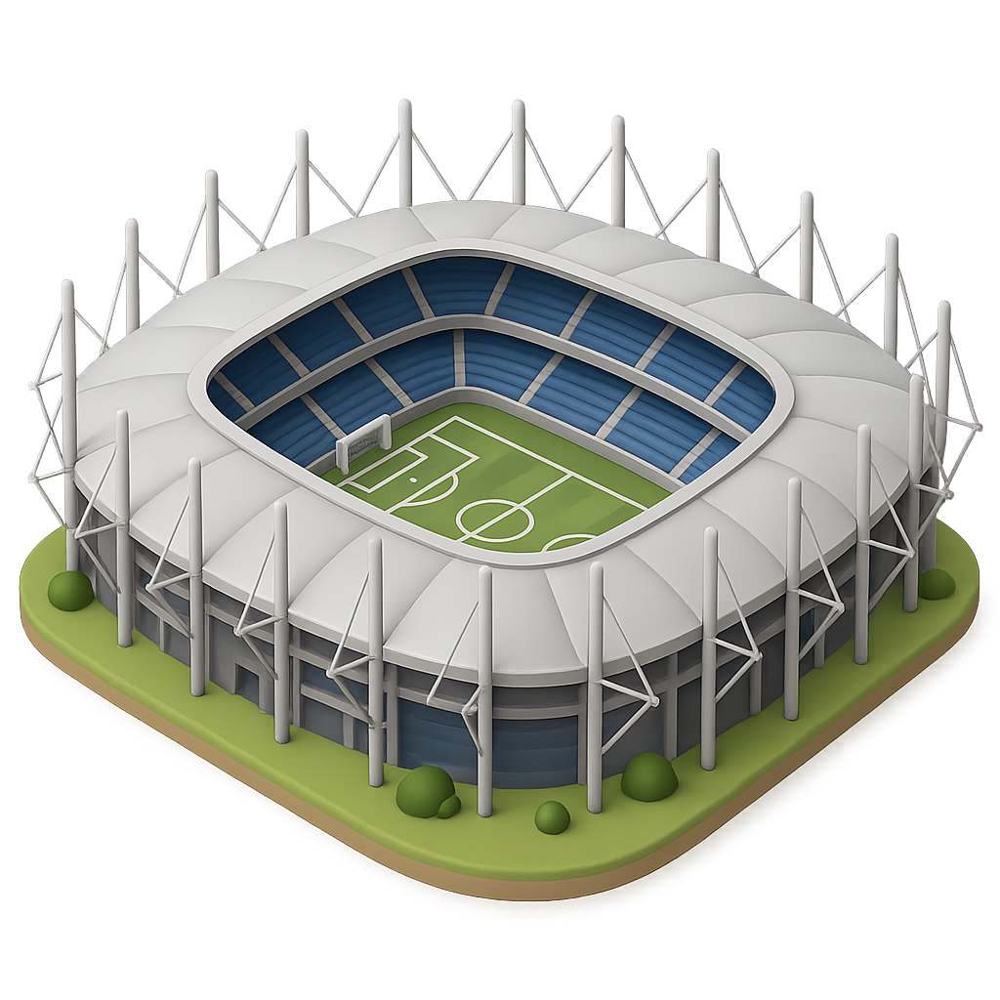

<p align="center">
  
</p>

# ⚽ K.I.S.S. League

> Proyecto desarrollado para el **Bootcamp de Fullstack PHP** de la [IT Academy](https://www.barcelonactiva.cat/itacademy) · **Barcelona Activa**
> Sprint 4

---

## 📋 Tabla de contenidos

- [Descripción del proyecto](#descripción-del-proyecto)
- [Funcionalidad de la aplicación](#funcionalidad-de-la-aplicación)
- [Stack tecnológico](#stack-tecnológico)
- [Arquitectura y estructura del proyecto](#arquitectura-y-estructura-del-proyecto)
  - [Backend](#backend)
  - [Frontend](#frontend)
  - [Base de datos](#base-de-datos)
- [Requisitos previos](#requisitos-previos)
- [Instalación y puesta en marcha](#instalación-y-puesta-en-marcha)
- [Poblar la base de datos con datos de prueba](#poblar-la-base-de-datos-con-datos-de-prueba)
- [Ejecutar los tests](#ejecutar-los-tests)

---

## Descripción del proyecto

**K.I.S.S. League** (Keep It Simple, Stupid League) es una aplicación web de gestión de resultados de fútbol. Permite registrar equipos y los resultados de sus partidos organizados por jornadas, al estilo de un sistema de administración de datos de una liga.

La aplicación fue construida siguiendo el principio KISS: una interfaz simple, limpia y directa al grano, sin florituras innecesarias. Está orientada a demostrar el dominio del patrón **MVC** con Laravel, incluyendo el uso avanzado de Eloquent ORM, Form Requests para validación, relaciones entre modelos y vistas Blade con layouts reutilizables.

---

## Funcionalidad de la aplicación

La aplicación se divide en dos grandes módulos de gestión:

### 🏟️ Gestión de equipos

Permite administrar el catálogo de equipos que participan en la liga. Cada equipo tiene un **nombre** (único) y una **ciudad** de origen.

| Operación | Descripción |
|-----------|-------------|
| Listar equipos | Muestra todos los equipos registrados, ordenados alfabéticamente, con paginación (9 por página) |
| Ver equipo | Muestra el detalle de un equipo concreto (nombre y ciudad) |
| Crear equipo | Formulario para dar de alta un nuevo equipo con validación de campos |
| Editar equipo | Permite modificar el nombre y/o la ciudad de un equipo existente |
| Eliminar equipo | Elimina un equipo, **con una protección importante**: si el equipo ya ha participado en algún partido, **no se puede eliminar** y se muestra un mensaje de aviso |

> **Nota sobre el modelo `Team`:** los campos `name` y `city` se almacenan siempre en minúsculas en la base de datos (mediante un **mutador** Eloquent) y se muestran siempre en mayúsculas en pantalla (mediante un **accesor**).

---

### ⚽ Gestión de partidos

Permite registrar los resultados de los partidos de la liga, organizados por jornadas.

Cada partido recoge:
- La **jornada** a la que pertenece (valor numérico del 1 al 24)
- La **fecha** del partido (nunca puede ser una fecha futura)
- El **equipo local** (seleccionado de los equipos registrados)
- Los **goles del equipo local**
- El **equipo visitante** (distinto obligatoriamente del local)
- Los **goles del equipo visitante**

| Operación | Descripción |
|-----------|-------------|
| Listar partidos | Muestra todos los partidos registrados, ordenados por jornada, con paginación (6 por página). Cada tarjeta muestra la jornada y el nombre de ambos equipos |
| Ver partido | Muestra el detalle completo del partido: jornada, fecha y el resultado con el marcador de ambos equipos |
| Crear partido | Formulario con validación completa para registrar un nuevo partido |
| Editar partido | Permite corregir los datos de un partido ya registrado |
| Eliminar partido | Elimina el registro del partido de la base de datos |

La validación de los formularios de partido incluye:
- Ambos equipos deben existir en la base de datos
- El equipo local y el visitante deben ser **diferentes**
- La fecha no puede ser posterior a la fecha actual

---

### 🏠 Pantalla de inicio (Home)

La página de inicio muestra dos tarjetas de acceso rápido con efectos visuales animados:
- **Gestión de Equipos** → lleva a `/teams`
- **Gestión de Partidos** → lleva a `/games`

---

## Stack tecnológico

### Backend
| Tecnología | Versión | Uso |
|------------|---------|-----|
| PHP | ^8.1 | Lenguaje principal del servidor |
| Laravel | ^10.10 | Framework MVC |
| Laravel Sanctum | ^3.3 | Scaffolding de autenticación |
| Laravel Tinker | ^2.8 | REPL interactivo para depuración |
| GuzzleHTTP | ^7.2 | Cliente HTTP |
| PHPUnit | ^10.5 | Testing |
| Faker | ^1.9 | Generación de datos falsos |
| Laravel Pint | ^1.0 | Linter/formateador de código PHP |
| Laravel Sail | ^1.18 | Entorno de desarrollo con Docker |

### Frontend
| Tecnología | Versión | Uso |
|------------|---------|-----|
| Blade | (Laravel) | Motor de plantillas |
| Tailwind CSS | ^3.4 | Framework de estilos utilitario |
| Vite | ^6.4 | Bundler y servidor de assets |
| Axios | ^1.6 | Cliente HTTP para JavaScript |
| PostCSS | ^8.4 | Procesador de CSS |
| Autoprefixer | ^10.4 | Prefijos CSS automáticos |

### Base de datos
- **MySQL** (conexión por defecto, puerto 3306)
- Nombre de la base de datos por defecto: `torneo`

---

## Arquitectura y estructura del proyecto

El proyecto sigue la arquitectura **MVC** (Modelo–Vista–Controlador) de Laravel.

### Backend

#### Modelos (`app/Models/`)

| Archivo | Descripción |
|---------|-------------|
| `Team.php` | Representa un equipo de la liga. Tiene relación `hasMany` con `Game`. Implementa **accessors** y **mutators** para los campos `name` y `city` (almacena en minúsculas, devuelve en mayúsculas). |
| `Game.php` | Representa un partido. Tiene dos relaciones `belongsTo` con `Team`: una para el equipo local (`local_team_id`) y otra para el visitante (`visitor_team_id`), accesibles mediante los métodos `local()` y `visitor()`. |
| `User.php` | Modelo de usuario generado por Laravel. Incluye autenticación con Sanctum. No tiene un rol activo en la lógica principal de la aplicación en este sprint. |

#### Controladores (`app/Http/Controllers/`)

| Archivo | Descripción |
|---------|-------------|
| `HomeController.php` | Controlador de acción única (invokable). Renderiza la vista `home.blade.php`. |
| `TeamController.php` | Controlador de recurso completo con los 7 métodos CRUD estándar de Laravel (`index`, `create`, `store`, `show`, `edit`, `update`, `destroy`). El método `destroy` incluye lógica de protección: impide eliminar un equipo que ya haya jugado algún partido. |
| `GameController.php` | Controlador de recurso completo con los 7 métodos CRUD estándar. Los partidos se listan ordenados por jornada (`gameweek`) y paginados de 6 en 6. |

#### Form Requests (`app/Http/Requests/`)

| Archivo | Descripción |
|---------|-------------|
| `StoreTeam.php` | Valida la creación de un equipo: nombre obligatorio (mínimo 3 caracteres, único en BD) y ciudad obligatoria. Mensajes de error personalizados en español. |
| `UpdateTeam.php` | Validación equivalente a `StoreTeam` para la edición de un equipo existente. |
| `StoreGame.php` | Valida la creación de un partido: jornada obligatoria, fecha obligatoria y no futura, equipos local y visitante obligatorios (deben existir en BD y ser distintos entre sí), marcadores obligatorios. Mensajes de error personalizados en español. |
| `UpdateGame.php` | Validación equivalente a `StoreGame` para la edición de un partido existente. |

#### Rutas (`routes/web.php`)

```
GET    /           → HomeController (home)
GET    /home       → HomeController (home)

GET    /teams               → TeamController@index
GET    /teams/create        → TeamController@create
POST   /teams               → TeamController@store
GET    /teams/{team}        → TeamController@show
GET    /teams/{team}/edit   → TeamController@edit
PUT    /teams/{team}        → TeamController@update
DELETE /teams/{team}        → TeamController@destroy

GET    /games               → GameController@index
GET    /games/create        → GameController@create
POST   /games               → GameController@store
GET    /games/{game}        → GameController@show
GET    /games/{game}/edit   → GameController@edit
PUT    /games/{game}        → GameController@update
DELETE /games/{game}        → GameController@destroy
```

---

### Frontend

#### Layouts (`resources/views/layouts/`)

La aplicación utiliza tres layouts Blade, cada uno con su cabecera específica:

| Archivo | Uso |
|---------|-----|
| `staticPage_layout.blade.php` | Layout para la página de inicio (Home). Fondo con imagen de balón, sin cabecera de navegación de módulo. |
| `teamsCrudPage_layout.blade.php` | Layout para todas las vistas del módulo de equipos. Cabecera con título "GESTIÓN DE EQUIPOS" y navegación (Home / Crear Equipo / Ver Equipos). Fondo con imagen de balón en blanco y negro. |
| `gamesCrudPage_layout.blade.php` | Layout para todas las vistas del módulo de partidos. Cabecera con título "GESTIÓN DE PARTIDOS" y navegación (Home / Crear Partido / Ver Partidos). Fondo con imagen de balón en blanco y negro. |

#### Parciales (`resources/views/layouts/partials/`)

| Archivo | Descripción |
|---------|-------------|
| `staticPage_header.blade.php` | Cabecera simple de la página de inicio |
| `teamsCrudPage_header.blade.php` | Cabecera responsiva del módulo de equipos con navegación |
| `gamesCrudPage_header.blade.php` | Cabecera responsiva del módulo de partidos con navegación |
| `staticPage_footer.blade.php` | Pie de página para la home |
| `crudPage_footer.blade.php` | Pie de página compartido para los módulos CRUD |

#### Vistas de Equipos (`resources/views/teams/`)

| Archivo | Descripción |
|---------|-------------|
| `index.blade.php` | Listado de equipos en rejilla responsiva (3 columnas en escritorio). Cada tarjeta muestra el nombre del equipo y revela un texto "Gestionar equipo" al pasar el ratón. Incluye paginación y sistema de avisos flash. |
| `create.blade.php` | Formulario de alta de un nuevo equipo con validación inline. |
| `edit.blade.php` | Formulario de edición del equipo con los valores actuales precargados. |
| `show.blade.php` | Vista detalle de un equipo: nombre y ciudad. Botones para editar y eliminar, con avisos flash de estado. |

#### Vistas de Partidos (`resources/views/games/`)

| Archivo | Descripción |
|---------|-------------|
| `index.blade.php` | Listado de partidos en rejilla responsiva (2 columnas en escritorio). Cada tarjeta muestra la jornada y el enfrentamiento (Local vs Visitante). Incluye paginación y sistema de avisos flash. |
| `create.blade.php` | Formulario de alta de un partido: selector de jornada (1-24), fecha, equipo local (desplegable), goles local, equipo visitante (desplegable) y goles visitante. La lista de equipos se obtiene directamente del modelo. |
| `edit.blade.php` | Formulario de edición con los valores actuales del partido precargados. |
| `show.blade.php` | Vista detalle del partido: jornada, fecha y marcador visual (nombre del equipo + goles en círculo). Botones para editar y eliminar. |

#### Assets y estilos (`resources/css/`)

El proyecto usa **Tailwind CSS** como framework de estilos principal, compilado y servido mediante **Vite**.

---

### Base de datos

#### Migraciones (`database/migrations/`)

**Tabla `teams`**

| Campo | Tipo | Descripción |
|-------|------|-------------|
| `id` | BIGINT (PK) | Identificador único |
| `name` | VARCHAR (único) | Nombre del equipo |
| `city` | VARCHAR | Ciudad del equipo |
| `created_at` / `updated_at` | TIMESTAMP | Fechas de auditoría |

**Tabla `games`**

| Campo | Tipo | Descripción |
|-------|------|-------------|
| `id` | BIGINT (PK) | Identificador único |
| `gameweek` | INT | Número de jornada |
| `date` | DATE | Fecha del partido |
| `local_team_id` | BIGINT (FK → teams.id) | Equipo local |
| `visitor_team_id` | BIGINT (FK → teams.id) | Equipo visitante |
| `local_score` | INT | Goles del equipo local |
| `visitor_score` | INT | Goles del equipo visitante |
| `created_at` / `updated_at` | TIMESTAMP | Fechas de auditoría |

> Las claves foráneas de `games` tienen restricción `ON DELETE RESTRICT`, lo que impide eliminar un equipo referenciado en un partido (protección también implementada a nivel de aplicación en el controlador).

**Relaciones Eloquent:**
```
Team ──hasMany──> Game (como local o visitante)
Game ──belongsTo──> Team (local_team_id → local())
Game ──belongsTo──> Team (visitor_team_id → visitor())
```

#### Seeders (`database/seeders/`)

| Archivo | Descripción |
|---------|-------------|
| `TeamSeeder.php` | Inserta 12 equipos ficticios de ciudades japonesas (Tokio, Osaka, Kyoto, Yokohama, Okinawa, Hokkaido) |
| `GameSeeder.php` | Inserta 12 partidos de prueba distribuidos en 2 jornadas (6 partidos por jornada), simulando el enfrentamiento de todos los equipos |
| `DatabaseSeeder.php` | Seeder raíz que orquesta la ejecución de los seeders anteriores |

---

## Requisitos previos

- **PHP** >= 8.1
- **Composer** >= 2.x
- **Node.js** >= 18.x y **npm**
- **MySQL** (o MariaDB) en ejecución local
- (Opcional) **Laravel Sail** para entorno Docker

---

## Instalación y puesta en marcha

### 1. Clonar el repositorio

```bash
git clone https://github.com/toniGitH/Kiss-league.git
cd Kiss-league
```

### 2. Instalar dependencias PHP

```bash
composer install
```

### 3. Instalar dependencias JavaScript

```bash
npm install
```

### 4. Configurar el entorno

Copia el fichero de ejemplo y edítalo con tus datos:

```bash
cp .env.example .env
```

Edita `.env` y ajusta al menos los parámetros de base de datos:

```env
DB_CONNECTION=mysql
DB_HOST=127.0.0.1
DB_PORT=3306
DB_DATABASE=torneo      # El nombre que quieras para la base de datos
DB_USERNAME=root         # Tu usuario de MySQL
DB_PASSWORD=             # Tu contraseña de MySQL
```

### 5. Generar la clave de aplicación

```bash
php artisan key:generate
```

### 6. Crear la base de datos

Crea manualmente en MySQL la base de datos con el nombre que hayas configurado en `.env`:

```sql
CREATE DATABASE torneo CHARACTER SET utf8mb4 COLLATE utf8mb4_unicode_ci;
```

### 7. Ejecutar las migraciones

```bash
php artisan migrate
```

### 8. Compilar los assets de frontend

Para desarrollo (con hot reload):

```bash
npm run dev
```

### 9. Lanzar el servidor de desarrollo

En una terminal separada (o en la misma si usas `npm run dev` en segundo plano):

```bash
php artisan serve
```

La aplicación estará disponible en **http://localhost:8000**

---

## Poblar la base de datos con datos de prueba

Para disponer de datos de ejemplo (12 equipos y 12 partidos listos para probar), ejecuta:

```bash
php artisan db:seed
```

O bien, si quieres volver a empezar desde cero (borrar todo y re-migrar con seeders):

```bash
php artisan migrate:fresh --seed
```

---

## Ejecutar los tests

El proyecto incluye una suite de tests con PHPUnit. Para ejecutarlos:

```bash
php artisan test
```

O directamente con el binario de PHPUnit:

```bash
./vendor/bin/phpunit
```

Los tests están organizados en:
- `tests/Unit/` → Tests unitarios
- `tests/Feature/` → Tests de integración / funcionalidad

> **Nota:** los tests utilizan la configuración de `phpunit.xml`. La conexión a base de datos para testing puede configurarse ahí (por defecto, usa la misma conexión MySQL definida en `.env`).

---

## Diagrama de la arquitectura

```
Navegador
    │
    ▼
routes/web.php
    │
    ├──► HomeController  ──────────────────────────► home.blade.php
    │
    ├──► TeamController
    │       ├── index()   ──► Team::paginate()  ──► teams/index.blade.php
    │       ├── create()  ──────────────────────► teams/create.blade.php
    │       ├── store()   ◄── StoreTeam (Form Request)
    │       ├── show()    ──► $team  ────────────► teams/show.blade.php
    │       ├── edit()    ──► $team  ────────────► teams/edit.blade.php
    │       ├── update()  ◄── UpdateTeam (Form Request)
    │       └── destroy() ──► [validación + delete()]
    │
    └──► GameController
            ├── index()   ──► Game::paginate()  ──► games/index.blade.php
            ├── create()  ──────────────────────► games/create.blade.php
            ├── store()   ◄── StoreGame (Form Request)
            ├── show()    ──► $game  ────────────► games/show.blade.php
            ├── edit()    ──► $game  ────────────► games/edit.blade.php
            ├── update()  ◄── UpdateGame (Form Request)
            └── destroy() ──► delete()
```

---

*Proyecto académico · IT Academy · Barcelona Activa · Sprint 4*
